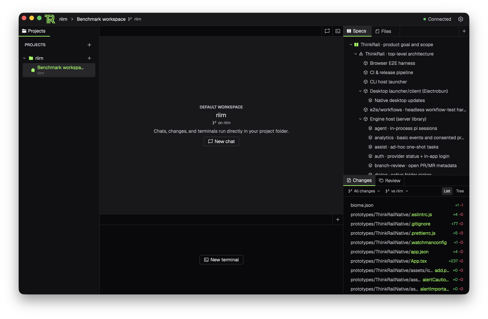

# ThinkRail — CommanderTvis fork, native macOS client

A fork of [JetBrains/thinkrail](https://github.com/JetBrains/thinkrail), a desktop-and-mobile client for the
[`pi`](https://www.npmjs.com/package/@earendil-works/pi-coding-agent) coding agent. This branch, `riirn`,
gives it a real Mac app: the same workbench, drawn with native macOS windows and controls instead of a
browser engine.



The workspace has the projects and worktrees list on the left, chats in the center, and files, changes,
specs and a terminal around them, laid out like the desktop app.

## What the fork has that upstream does not

**A native macOS client.** [`apps/native`](apps/native) is a React Native for macOS app with an integrated
titlebar, traffic lights, the application menu and native window resizing. It connects to a running
ThinkRail host, so projects, worktrees, chats and terminals behave exactly as in the desktop app.

The app covers project and workspace navigation, streaming chats with model controls, a file tree,
rendered Markdown documents, changes and diff views, a terminal, tasks, review comments, specs, skills and
settings. It is a prototype: the Monaco editor, docking, extension UI, updates and several advanced
settings are not there yet.

**Automated end-to-end tests.** The upstream browser e2e suite is ported to run inside the native app.

**Benchmarks against the desktop app.** Cold-launch time and memory footprint are measured side by side;
the results are in [`apps/native/BENCHMARK.md`](apps/native/BENCHMARK.md).

## Run

The fork is developed and tested on macOS only.

Prerequisites: Bun, Node.js 22.19 or newer, Xcode, CocoaPods, `git` on PATH, and an authenticated `pi`
provider. App state lives under `~/.thinkrail`.

```bash
git clone git@github.com:CommanderTvis/thinkrail.git
cd thinkrail
git checkout riirn
bun install
cd apps/native
bun install --frozen-lockfile
pod install --project-directory=macos
bun run macos
```

Start a ThinkRail host on port 43423 before opening the app. Details, environment variables and a
Release build are in [`apps/native/README.md`](apps/native/README.md).

## Updating

The branch is force-pushed. A plain `git pull` will not fast-forward; take the remote branch as it is:

```bash
git fetch origin
git reset --hard origin/riirn
bun install
```

## Analytics & Privacy

Unchanged from upstream: basic usage events (launches, chat creation, accepted message sends, provider
connections) are always on; additional setup, run-outcome, task, review, and PR statistics follow an optional
sharing preference. `thinkrail --no-analytics` or `THINKRAIL_NO_ANALYTICS=1` suppresses additional events
for that run only. The [analytics spec](packages/server/src/analytics/SPEC.md) defines the event
boundaries.

