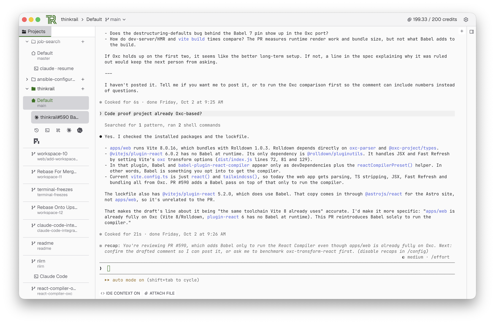
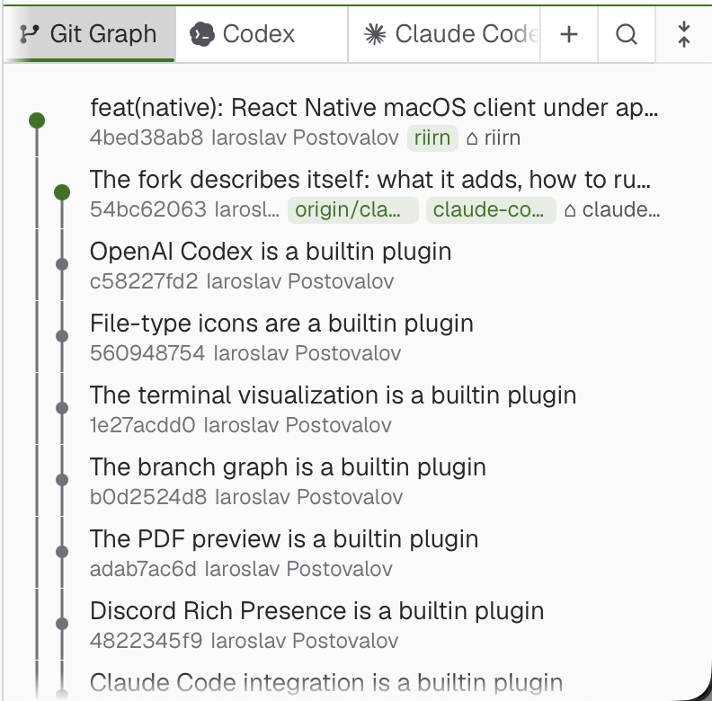
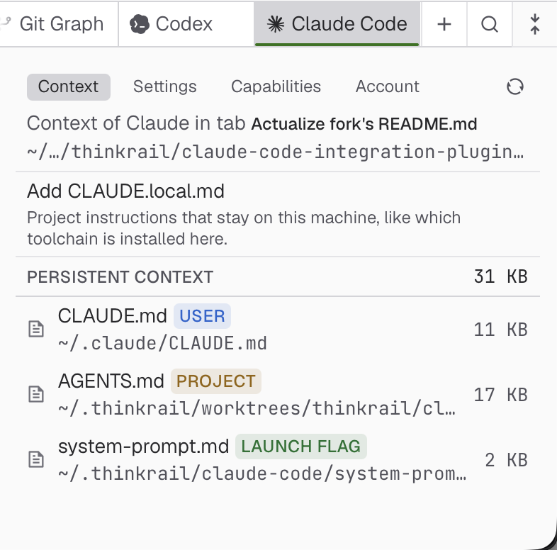
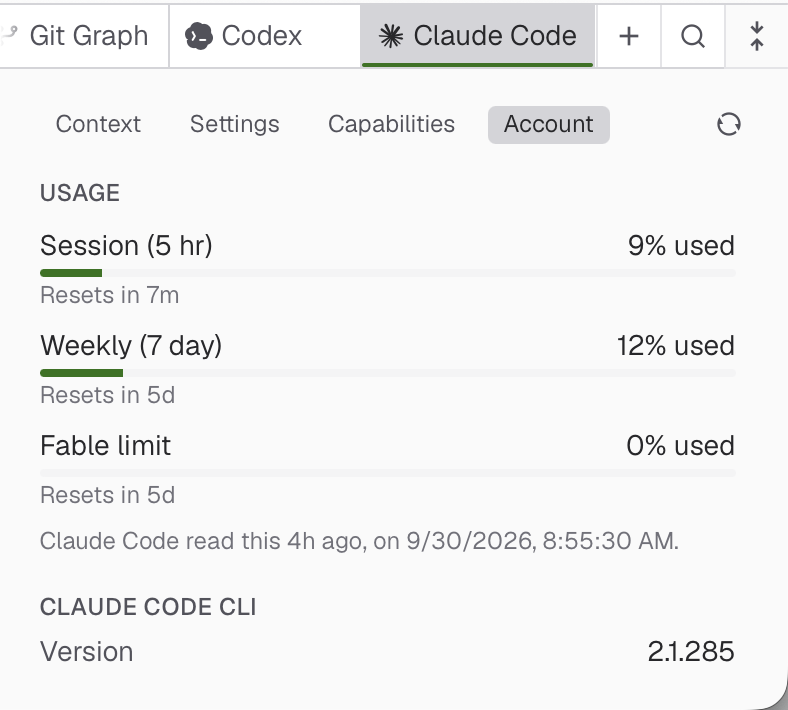
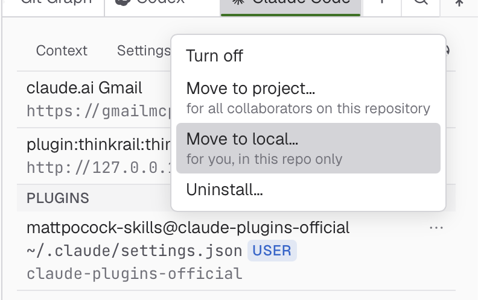
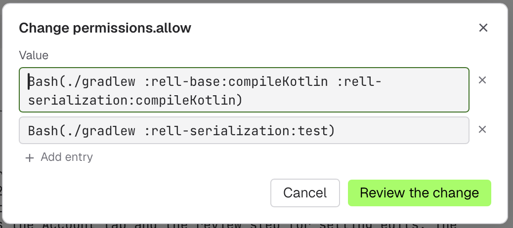
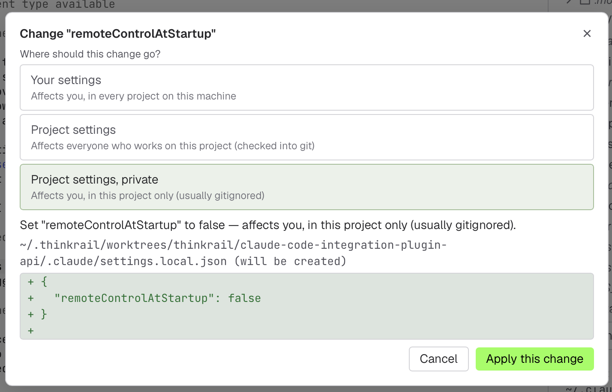
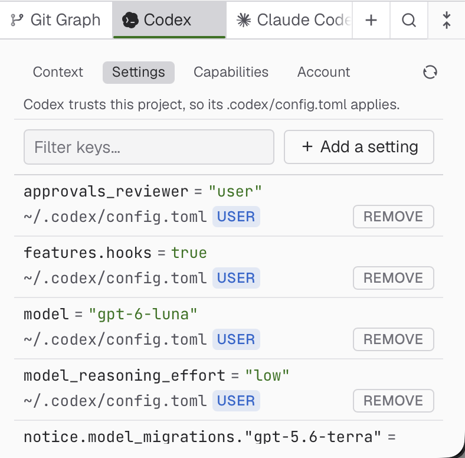
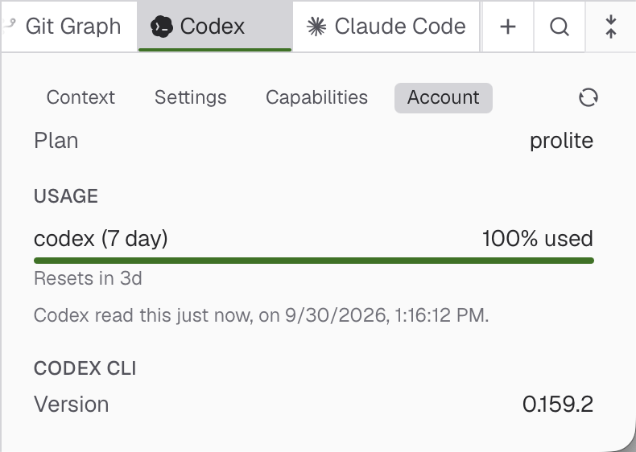
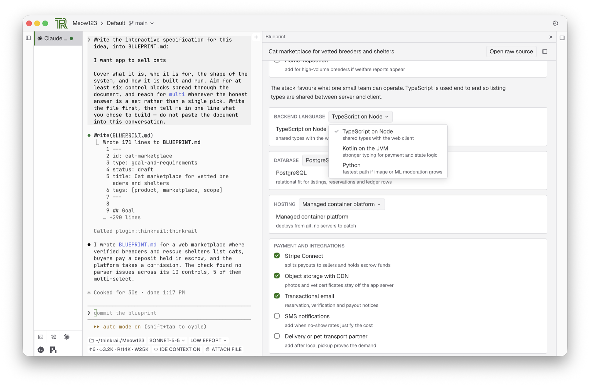

# ThinkRail — CommanderTvis fork

A fork of [JetBrains/thinkrail](https://github.com/JetBrains/thinkrail). Upstream is a desktop-and-mobile
client for the [`pi`](https://www.npmjs.com/package/@earendil-works/pi-coding-agent) coding agent. This
fork turns it into a workbench for more than one agent: Claude Code runs in its terminals as a first-class
agent, with its own configuration pane, IDE bridge, hooks, launcher and the workspace's spec tools reachable
over MCP.



## Plugin API

`packages/plugin-api` is the contract: a manifest, typed methods, channels and settings, a
pi-free tool definition for the agent and MCP surfaces, and host and web contexts. The server loads builtin
and external plugins, validates their wire traffic, serves their assets and feeds their pi resources into
every session; the web client loads a plugin's UI half, at build time for builtins or over the wire for an
external one. `packages/ui` is the shared UI kit plugins draw with. External plugins live under
`~/.thinkrail/plugins/<id>/` or at the paths `AppConfig.pluginPaths` lists, and are enabled and disabled
while the app runs. A plugin defines a tool once and both a `pi` chat and a terminal agent (over MCP) can
call it. Plugins add side tools, launchers, tab decorations, file viewers, file icons, settings sections
and terminal accessories. See [`packages/plugin-api/SPEC.md`](packages/plugin-api/SPEC.md) and
[`packages/server/src/plugins/SPEC.md`](packages/server/src/plugins/SPEC.md).

## Builtin plugins

Eight builtin plugins, each kept in its own commit so it can be extracted to its own repository. Claude Code and Codex
integrate terminal agents; the others add specification tools, viewers or presence:

| Plugin | What it adds |
| --- | --- |
| [`plugin-spec-dialect`](packages/plugin-spec-dialect) | the spec-graph read, the Specs side tool and the `spec_*` tool renderers |
| [`plugin-blueprint`](packages/plugin-blueprint) | the Blueprint interactive-spec format, its author and reactor |
| [`plugin-claude-code`](packages/plugin-claude-code) | Claude Code as the terminal agent: config pane, IDE bridge, hook status, launcher, terminal facts and picker driving, the shipped Claude marketplace |
| [`plugin-codex`](packages/plugin-codex) | OpenAI Codex as a terminal agent: config pane, launcher, hook status, `/ide` editor context and ThinkRail MCP tools |
| [`plugin-discord`](packages/plugin-discord) | Discord Rich Presence over local IPC |
| [`plugin-branch-graph`](packages/plugin-branch-graph) | the project's Git Graph side tool |
| [`plugin-visualize`](packages/plugin-visualize) | the terminal agent's live drawing surface, surfaced as an MCP tool |
| [`plugin-file-icons`](packages/plugin-file-icons) | material-icon-theme file-type glyphs |



The Git Graph side tool draws the project's branches and commits beside the terminal.

### Claude Code

The Claude Code plugin bridges terminal agent sessions to ThinkRail's workspace and UI.

- The terminal bar drives Claude Code's interactive `/model` picker and effort slider, and its Attach File button inserts workspace-relative `@file` paths.
- An IDE bridge feeds terminal events and facts into the app; hook status badges each tab, and resume works after a terminal is revived.
- The plugin ships its own Claude marketplace with a hook plugin, and keeps Claude's cached copy at the shipped version through Claude's own install and update commands.
- An agent that Claude Code starts, such as Codex, never takes over the tab.

<table>
<tr>
<td></td>
<td></td>
</tr>
<tr>
<td></td>
<td></td>
</tr>
<tr>
<td colspan="2" align="center"></td>
</tr>
</table>

The Context tab displays active instructions across global `~/.claude/CLAUDE.md`, project `CLAUDE.md`, referenced `AGENTS.md` files and launch flags, with live size accounting. The Account tab shows session and weekly usage limits and the CLI version. The Capabilities tab lists installed plugins, skills, hooks and ThinkRail's loopback MCP server, and moves any capability between User, Project and Local scope. Settings are edited in place, and each change asks which settings file it goes to and shows the diff before it is written.

### Codex

The Codex plugin runs the Codex CLI in a terminal the way Claude Code runs.

- A right-click launcher offers continue, resume or fork, sandbox choice, reasoning effort and web search.
- Tab status comes from Codex's own lifecycle hooks, installed once into `~/.codex/hooks.json` and inert outside a ThinkRail terminal.
- The model chip switches a running session's model for that session only, never saving a new default.
- An IDE bridge speaks Codex's `ide-context` protocol, so `/ide` sees the open files, the active file and the selection without the VS Code extension.
- The config pane resolves project, user and system `config.toml` with provenance, shows the `AGENTS.md` chain, and edits values in place by TOML type, each key linking to Codex's configuration reference.

<table>
<tr>
<td></td>
<td></td>
</tr>
</table>

Configuration discovery covers the user, system and worktree-root files; profiles and nested project
configuration are not modelled. See [`packages/plugin-codex/SPEC.md`](packages/plugin-codex/SPEC.md) for
the current scope and limitations.

### Blueprint, spec dialect and the rest



- Blueprint pairs agent authoring with an interactive spec viewer for terminal agents and `pi` chats. The agent writes `BLUEPRINT.md` and verifies it with the `blueprint_check` MCP tool; the viewer renders decision cards, option selectors and rationale blocks live. It builds on the spec dialect, which owns the Specs panel and the `spec_*` tools for every session and sub-agent.
- The terminal visualization plugin gives the agent a `visualize` tool: it draws, publishes, then waits for your verdict. Drawings persist per terminal.
- The Git Graph draws commit lanes, is hidden in a folder with no history, and scopes the Changes panel when you click a commit.
- Discord Rich Presence is off by default, with a blocklist of projects and a switch for showing file names.
- File icons use recoloured material-icon-theme glyphs, with a fallback when the plugin is off.

### Improvements that apply to upstream directly

Kept as atomic commits so each can become a pull request:

- Projects and files: open a plain folder as a project without git, clone a repository URL into a project,
  search the whole workspace from one popup, create, rename, drag and trash files in the tree, reveal a
  file in the file manager, and a notice when an open file is deleted on disk.
- Editing and previews: an outline column that drives preview and source, frontmatter as an
  Obsidian-style properties block, Cmd+F in every preview, zoomable inline diagrams, a code font of your
  choice with ligatures, and an editor selection sent into a pi chat.
- Workbench: vertical tabs under their workspace, a frame that belongs to its project, branch pickers
  that show every remote, and a desktop window that returns to its port with its tabs.
- Terminals and agents: the spec tools reachable by any terminal agent over MCP, a terminal that thaws
  after a lost drain event, a pty that no longer inherits a stale utmpx user, live reattach that restores
  full-screen input modes, and a default model, hidden models and JetBrains AI org switching in Settings.

## Clone and run

The fork is developed and tested on macOS only. Other platforms build, but nothing here has been run on
them.

Prerequisites: Bun 1.4.0, Node.js 22.19 or newer, and `git` on PATH. Authenticate the Claude Code or Codex
CLI to use its terminal integration, or a `pi` provider for built-in chats. App state lives under
`~/.thinkrail`.

```bash
git clone --branch claude-code-integration-plugin-api https://github.com/CommanderTvis/thinkrail.git
cd thinkrail
bun install
bun run dev                          # host + web client in the browser
```

For the desktop app:

```bash
bun run desktop:dev
```

Update this checkout with Git and rebuild it. The upstream installers and releases install JetBrains'
build, without this fork's plugins.

## Analytics & privacy

CommanderTvis fork builds omit the analytics key and send no usage analytics or installation attribution.
The behavior below describes upstream builds configured with an analytics key.

ThinkRail collects basic usage events — launches, chat creation, message sends, provider connections — tied to
a random installation ID. Usage analytics never include prompts, code, files, credentials, or account
identity. Additional product usage and how you found ThinkRail are shared only while **Share additional usage
data** is on; the switch is offered at first launch and lives in **Settings → Privacy**. When launching from
the command line, `thinkrail --no-analytics` (or `THINKRAIL_NO_ANALYTICS=1`) turns additional sharing off for
that run. With additional sharing on, a packaged build may open the ThinkRail blog in your browser once to
link your installation to the website visit that brought you here — only where you accepted marketing cookies on the
website or no consent is required — and that link expires after 30 days.
