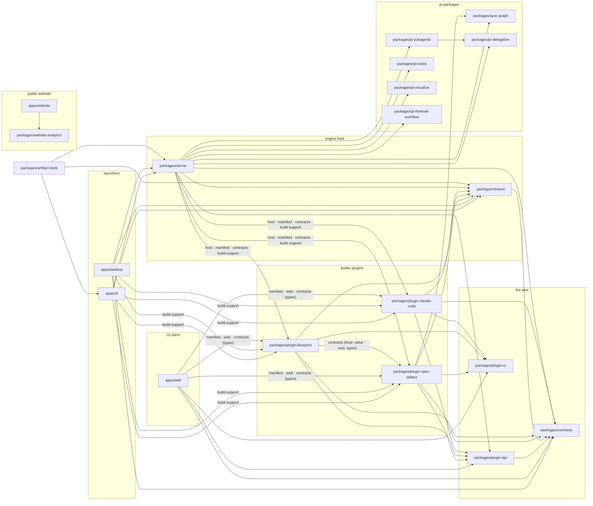

## Drivers

The product is built around the `pi` agent, run **in-process** (`createAgentSession`). V1 has two
additive launchers over the same host library: the retained CLI boots the engine host and opens a browser,
while Electrobun packages that host with a native system-webview shell. The desktop V1 profile is local
only; a later shared-client profile can dial an existing host. The UI ships independently of the host and
dials it over the network; a phone reaches the selected host over Tailscale.

## Topology — three rings

- **Engine host** (`packages/server` + `packages/shared`, launched by `apps/cli` or `apps/desktop`
  in local-host mode): owns `pi`, session state, persistence, and serves the wire endpoint. It bundles pi
  extensions (`pi-web-access`, `pi-visualize`, `pi-thinkrail-workflow`) into every session directly, and
  loads the three builtin plugin packages plus any external plugin found on disk through
  `packages/server/src/plugins` — the loader that composes a plugin's host half against the same seams
  core features use. A plugin's own `pi` extensions and skills, spec-dialect's included, ride the same
  per-session resource loader as the directly bundled ones.
- **The wire** (`packages/contracts` and `packages/plugin-api`): the typed, versioned protocol — the only
  coupling between client and host, plus the contract a plugin is written against so its own methods,
  channels, and UI contributions can live outside either ring. `packages/plugin-ui` is the shared
  component kit a plugin's web half is built against, never a wire concern of its own.
- **UI client** (`apps/web`): a mobile-first React client, transport-driven and endpoint-configurable,
  shippable as static assets independent of the host. Its dependency edge widens from `contracts` alone to
  `contracts` + `plugin-api` (the `/web` entry and root types) + `plugin-ui`, plus each builtin plugin
  package's `./manifest` value and `./web` module (an external plugin's web half arrives over the wire
  instead, fetched from `/plugin/<id>/...` rather than imported at build time).

```
apps/cli        browser host launcher: boot server + open browser ── depends on ─▶ packages/server
apps/web        UI client (mobile-first)                           ── depends on ─▶ packages/contracts, packages/plugin-api, packages/plugin-ui, each builtin plugin package's ./manifest + ./web
apps/desktop    Electrobun local-host launcher (V1)                ── depends on ─▶ packages/server, packages/contracts, packages/shared

apps/website    public landing + blog + /vibecoding (Cloudflare Pages) ── depends on ─▶ packages/website-analytics
packages/website-analytics  dependency-free browser analytics policy for the public website
packages/server createServer(): Bun.serve(HTTP+WS) + AgentSessionManager (in-process pi) ── depends on ─▶ packages/contracts, packages/shared, packages/pi-delegation, packages/pi-subagents, packages/plugin-api, the three builtin plugin packages
packages/contracts  the wire (types-only)
packages/plugin-api the contract between the host, the web client, and a plugin — builtin or external
                    ([[module-plugin-api]])
packages/plugin-ui  shared UI kit a plugin's web half is built against (shadcn primitives, markdown,
                    editor, visualization card)
packages/plugin-spec-dialect   builtin plugin: the spec graph, its panel, and the spec_* tools
packages/plugin-blueprint      builtin plugin: the blueprint format, depends on plugin-spec-dialect
packages/plugin-claude-code    builtin plugin: Claude Code integration (IDE bridge, terminal facts, config)
packages/shared     shellEnv (server-side only)
packages/pi-visualize          portable pi extension: the visualize tool (bundled into every session)
packages/pi-delegation         portable pure-pi package: the delegation core — agent sessions spawned
                    from agent sessions (createChild + run-owning handle, lineage, registry, events)
packages/pi-subagents          portable pure-pi extension: Agent + get_subagent_result tools over
                    pi-delegation (bundled into every ThinkRail parent session by packages/server)
packages/pi-thinkrail-workflow pi extension: the workflow skill system + its always-on routing rule
                    (bundled into every session; workspace-internal, not portable)
```

### Module graph, by dependency

Every arrow is an edge `scripts/check-module-boundaries.ts` allows (manifest dependencies and static
imports alike; `bun run check:boundaries` fails on any other); a label names the only package subpaths
that edge may reach. Arrows point at what a module depends on. `pi-web-access` (npm) is the one bundled
extension that is not a workspace package.



Inside a plugin package a further rule holds: its `web/` files may not import its `host/`, so the two halves
meet only through the manifest and the contract. Packages with no outgoing arrow (`contracts`,
`plugin-ui`, `pi-delegation`, `pi-todos`, `pi-visualize`, `pi-thinkrail-workflow`, `spec-graph`,
`website-analytics`) depend on nothing in the workspace, which is what lets each ship on its own.

Artifact verification is a separate source-only workspace, [[module-artifact-tests]]. It depends on
CLI build metadata, server test fixtures, and shared teardown; root tools and browser E2E consume it.
No product package imports the test workspace, and it has no application build step or Electrobun SDK
dependency. This keeps test process drivers outside both launchers and the server library.

## Decisions

1. **Client/host split.** Engine host owns `pi` and state; the UI is a portable client; the wire is the
   only coupling. **Rule: `apps/web` depends on `packages/contracts` only** — never on `server` or
   `shared`. That single edge is what makes the UI shippable without the host.
2. **Launchers are thin; the host is a library.** `apps/cli` and `apps/desktop` both embed the shared
   boot path in-process. CLI opens a browser; desktop opens a native system webview on a fresh one-origin
   loopback host. Neither owns engine logic or spawns the other. The CLI remains a complete independent
   artifact and rollback. A later desktop shared-client profile may omit the local host; every profile uses
   the same wire and web artifact.

   **One feature path across deployments.** An ordinary product feature changes its contract, the owning
   server feature module, the shared web client, and their tests — never each launcher. Launchers and future
   deployments own only composition, lifecycle, endpoint selection, native presentation, and artifact
   packaging. A real second environment that cannot supply an existing host operation earns one narrow port
   in the feature module that owns that behavior; do not pre-abstract the host behind a global platform
   adapter. Physical runtime requirements are declared once through the server-owned build-support manifest,
   then transformed by each packager. The same behavior and artifact suites run through every launcher, so
   reuse is enforced by boundaries and conformance rather than parallel implementations.
3. **The wire is versioned.** `contracts` is types-only; `server.welcome` carries a protocol version so
   an independently-shipped UI can detect host-version drift.
4. **Transport endpoint is a parameter.** Defaults to same-origin (`location.host`); a remote browser,
   desktop, or mobile client points it at the selected host's Tailscale MagicDNS name. Native resume state
   is keyed by backend profile so ids from one host are never interpreted against another.
5. **UI = panels + shell.** Layout-agnostic, store-driven panels (project→workspace nav, file tree,
   Monaco editor, changes/diff, workspace-local review, terminal, chat, composer) never know their
   arrangement. Each desktop frontend window owns one locally persisted, resource-free workbench frame: a
   recursively split center plus auxiliary groups in vertical left/right stacks and a horizontally grouped
   bottom region. The frame's topology, singleton-tool placement, visibility, folds, geometry, and alignment
   remain unchanged when that window switches workspace; workspace-scoped resources and attention project
   into it from separate local views. Terminals may occupy center or auxiliary groups, with new workspaces
   defaulting one terminal to bottom. Another window never rearranges this one. A future mobile shell may
   project the same panels differently; desktop docking does not define that projection. Detail:
   [[submodule-web-shell-layout]].
6. **Workspaces are git worktrees (V1).** project (git repo) → workspace (`git worktree` on its own
   branch/cwd, under `~/.thinkrail/worktrees`) → {chats, files, terminals}. **Two deliberate
   exceptions, both `kind`-marked on the wire and both *user-owned* — never renamed or reclaimed by
   ThinkRail:** every project carries exactly one built-in **Default workspace** (`kind: "default"`)
   whose cwd is the project folder itself (git's *main working tree*) — non-removable, non-renamable,
   and entered explicitly from the project's Welcome fork ("Work in project folder"), never
   auto-entered — the "just work in my project folder" anchor for users lost in the
   worktree model; and an **existing worktree** the user explicitly attaches in place
   (`kind: "external"`), which ThinkRail may forget but never mutates (see
   [[submodule-server-workspaces]]). The shell is built first,
   `pi` connected last. **Open PR is V1**: a deterministic, host-side push + open/update of the branch's
   GitHub PR through the user's own `gh` CLI (no stored tokens, no provider REST API), body rendered from
   the verified plan, with a compare-URL fallback when `gh`/GitHub isn't available (see
   [[submodule-server-pr]]). CI/Checks status, merge/squash from the app, and `glab` support stay V2;
   workspace-local Review is V1.
7. **Auth is external.** Tailscale ACLs / device identity are the auth; the app carries an `owner` field,
   not a login UI.
8. **Hydrate-then-stream (every client reconstructs domain state from the host).** A client never relies on
   having *witnessed* events to know domain state—on connect it **reads** current state, then **subscribes**
   to live deltas. The host exposes `project.list` / `workspace.list` / **`session.list`** /
   **`session.getMessages`** alongside `pi.event`. A reload, second tab, phone, or **host restart** therefore
   rebuilds the same projects, workspaces, sessions, and transcripts. `session.list` unions in-memory sessions
   with pi's on-disk sessions; on that authoritative read a surface hydrates its locally placed chats, then
   passively auto-opens a bounded number of the newest unplaced sessions that are still live or carry open
   todos (a single most-recent session opens as a fallback when nothing qualifies and nothing is placed yet,
   so a workspace never lands empty while chat history exists), and lists everything else in history for
   explicit reopen. This one auto-open attempt fires once per surface-workspace connection, not on every
   catalog re-read, and a surface resolving an exact-chat route target defers it entirely to that target.
   `session.created` supplies that history-only live delta when another frontend starts a session; reconnect
   repairs a missed delta through `session.list`. The client is a **stateless
   projection of domain state**, never a second domain source of truth; it separately owns frontend-local
   navigation and workbench view state. An automatic agent run
   remains active through retries, compaction, and queued continuations: pi's `agent_end` is only an
   attempt boundary and may precede more work; `agent_settled` is the authoritative transition to idle.

   **Chat-title contract.** A workspace display name, its Git branch/cwd,
   and each chat title are independent identities; no rename cascades between them. A chat title is pi's
   durable session name (`session_info`), never browser view state or a host sidecar. An unnamed chat gets
   one best-effort title from its first accepted text prompt through a bounded, tool-free one-shot completion
   running in parallel with the agent; unavailable or unusable generation falls back to deterministic
   prompt-derived text and can never delay or fail the message send. The write is conditional on the pi name
   still being absent, so any durable manual name always wins. Later turns never retitle automatically;
   scope drift is handled by manual rename (with explicit user-triggered regeneration a possible later
   feature). Clients hydrate `SessionSummary.title`, converge live on `session_info_changed`, and continue to
   route by session id, so duplicate human titles are legal.
9. **Domain state, frontend-local frame, and workspace-local views.** *Domain* state — projects,
   workspaces, **sessions + their transcripts**, terminal catalogs/PTYs, and git — is backend-owned, shared,
   and persistent; every client hydrates it from the host. Current workbench state is view state and never
   crosses the wire. Each browser tab or native window owns exactly one resource-free `WorkbenchFrame` for
   center and left/right/bottom topology, singleton-tool placement, visibility, folds, normalized geometry,
   bottom alignment, and restore targets. It separately owns one `WorkspaceViewState` per workspace for open
   file/diff/chat/document/terminal placements, tab order, and previews, plus a per-workspace `LayoutAttention`
   overlay keyed into that frame. The mounted workbench is a projection of those local values, not another
   authority.

   Frame mutations are local to one frontend window and persist through its shell-owned local storage
   adapter. Switching workspace changes only the projected workspace view. Empty groups remain until an
   explicit frame command removes or merges them; such a command atomically rehomes affected resources in
   every locally retained workspace view. Applying a preset does the same. Another browser, device, or window
   neither receives nor adopts those changes. Built-in presets and the default used by an explicit local frame
   reset remain client-owned; only bounded, resource-free custom preset definitions are host-persisted and broadcast as
   settings. No current-layout snapshot, revision, mutation, read/write method, or push channel exists on
   the wire.

   This remains placement only, never resource lifetime. Closing a file/chat placement is local and the
   session remains; terminal close retains its explicit host-domain PTY semantics. The active client location
   is likewise local: one backend-relative route names main / Project Home / workspace / exact chat; web stores
   it in a versioned fragment, while native shells persist it per backend profile and window. Incoming ids are
   validated against hydrated host state, and no backend-owned “current screen” or current layout lets one
   client move another. A frontend surface with no valid local document starts directly from the Balanced
   frame. Previously persisted host layout snapshots and old browser attention entries are never read,
   migrated, or deleted; retired config, preset, and terminal-marker shapes are ignored rather than upgraded.
   Detail: [[submodule-web-shell-layout]] and [[submodule-web-shell-layout-state]].
10. **Dependencies pin exact versions.** Every dependency in every manifest pins an **exact** version — no
    ranges (`^` `~` `>` `<` `.x` `*`). Rationale: `pi` ships breaking releases daily, so a floating range is
    a live wire; more broadly, a silent minor/patch bump is the classic irreproducible-build trap. Exact
    pins make the lockfile the single source of a dependency's version and turn every upgrade into an
    explicit, reviewable diff. Cross-cutting deps (pi, TypeScript, typebox, bun types) are pinned **once** in
    the root `workspaces.catalog` and referenced via `catalog:`, so their version lives in exactly one place.
    **Enforced**, not just documented: `scripts/check-catalog.ts` (`bun run check:deps`, in pre-commit + CI)
    rejects any range, any catalog drift, and a lockfile graph that resolves `react` or `react-dom` outside
    its one catalog pin (the temporary prerelease override rationale belongs to [[module-web]]). Exempt:
    `peerDependencies` (extension packages declare `"*"` on purpose — the host provides the dep) and local
    protocols (`workspace:` / `link:` / `file:`). An exact SemVer prerelease/build suffix is still an exact
    pin (`19.3.0-canary-a1124489-20260826`); the checker accepts the full identifier grammar, including
    hyphens, without admitting a range.

    The root `packageManager` field also pins Bun for development, CI, and CLI compilation; Bun types
    live in the catalog. Bun `1.4.0` aligns these paths with the desktop runtime, whose version is still
    owned independently by its Electrobun release (see [[module-desktop]]). CI reads the root pin rather
    than maintaining a second version in workflow YAML.

11. **Terminal = xterm.js on the DOM renderer.** The browser terminal is `@xterm/xterm`, driven from
    `apps/web/src/panels/TerminalInstance.tsx` against a real PTY (`bun-pty`) in
    `packages/server/src/terminal`. It stays the choice because it is the only production-ready browser
    terminal: the credible alternatives are all Ghostty's VT engine compiled to WebAssembly (`ghostty-web`,
    `restty`, `wterm`), and the most mature of them has a single tagged release that can do neither mouse
    reporting nor OSC 8 links — vim/htop/lazygit would regress. **The renderer is deliberately the default
    DOM one**, not `addon-webgl`: xterm's own maintainer names the DOM renderer a prerequisite for touch
    support, and WebGL carries defects we would inherit (`WebglAddon.dispose()` leaks its WebGL2 context —
    fatal for our per-worktree terminal churn — plus iOS context-limit crashes). Loading `addon-webgl` would
    be a regression, not an upgrade; ligatures and `rescaleOverlappingGlyphs` are the accepted cost. Coupling
    is kept deliberately thin (about a dozen xterm API members; no parser hooks, decorations or
    serialization), so a swap stays a contained rewrite of one file. **Re-evaluate when both** (a) upstream
    tags `libghostty-vt` with an official WASM/npm distribution, and (b) `ghostty-web` ships past 0.4.0 with
    mouse reporting and OSC 8 working.

12. **A shell belongs to a tab, and the host owns the mapping.** Terminals are keyed by
    `(workspaceId, tabKey)`; `terminal.reserve` may durably establish the catalog tab without a process, while
    one idempotent `terminal.attach` remains the only way its PTY is born. Reservation persists before
    publishing membership and rolls back its in-memory insertion if persistence fails. This separation lets a
    synchronized hidden default placement survive reload and another client without starting a shell. The
    client keeps no tab→shell pointer of its own. Shells are **owner-scoped**, matching `history`/`todos`/`templates`, so
    they survive a reload, a closed browser and a different browser — attach is exclusive, and taking a tab
    over notifies the displaced client. Lifetime is bounded by reference (no tab → no shell) plus the host
    process, **not** by timers: no idle culling, no abandoned-client reap. A host restart cannot preserve
    shells (in-process `pi`, PTY hangup), so tabs are revived with fresh shells showing recorded output.
    **tmux was rejected** as the persistence layer: an unassumable dependency on Windows, a competing tab
    model, env-propagation breakage, and polling-based capture — for restart survival we have already
    decided not to hold. Detail: [[submodule-server-terminal]].
13. **The blueprint format is proved on two agent hosts, and that is not a second engine.** The
    interactive-spec generator runs on the in-process `pi` runtime *and* on Claude Code headless
    (`--print --output-format stream-json`), because a document format that only one runtime can produce
    is a format tied to a vendor — and the format is the artefact here, not the runtime. This does **not**
    reopen the pi-only engine decision: neither runner is an agent *session*. They take a system prompt
    and a prompt and return text; they hold no tools, no filesystem access, no session state, and nothing
    in `AgentSessionManager` knows they exist. Chats, workspaces, skills and compaction remain `pi`'s
    alone, in-process, exactly as the goal spec says. The Claude runner is additionally gated on the
    Claude Code plugin (`@thinkrail/plugin-claude-code`) being enabled — read generically, as whichever
    registered launcher answers to id `"claude"` — so a user who does not run Claude Code never acquires a
    `claude` subprocess. The format and its reactor are now `@thinkrail/plugin-blueprint`, an
    external-shaped builtin plugin. Detail: [[module-plugin-blueprint]], [[module-plugin-claude-code]].
14. **Central's cross-module lifecycle has one architectural owner.** Its adapter, runtime generation,
    wire status/quota, synchronized preferences, provider card, and top-bar readout remain in their bounded
    modules; the correspondence between those surfaces and their liveness obligations belongs to
    [[central-integration]]. This keeps feature-specific mechanics in
    their leaf specs while making a non-terminating composition visible at the architecture layer.

14. **The public website is one origin, artifact, and production deployment.** `apps/website` owns `/`,
    `/blog/`, and `/vibecoding/` in one static Astro build deployed through one Cloudflare Pages project.
    React and Tailwind are permitted only inside [[submodule-website-vibecoding]]; unrelated routes retain
    their vanilla runtime and hand-written stylesheet. Browser analytics and consent initialize once on the
    exact `thinkrail.ai` origin. The retired `vibecoding.thinkrail.ai` hostname is an edge redirect that
    preserves path and query, never a proxy to a second site.

15. **Desktop packaging preserves the host/runtime boundary.** Electrobun `2.0.1` explicitly selects
    its release-owned Bun `1.4.0` runtime and embeds the host in that process, not the default Cottontail
    runtime; it never wraps or spawns the CLI. Its exact npm bootstrap pin selects the Hutch build
    toolchain and generated SDK; Bun remains the workspace package manager. The native window loads the
    packaged web build from the host's actual loopback port so UI, wire, files, and SPA fallback keep one
    origin. Native resources that require paths stay unpacked. The shell sets the staged `bun-pty` library
    before server import and loads PI from a separately bundled `.ts` runtime so external TypeScript
    extensions receive PI's bundled virtual modules rather than nonexistent built-Node aliases. The CLI
    and desktop share host boot and graceful shutdown, but launchers enforce no process-wide single-instance
    or canonical-data-directory ownership policy. Each host binds its own loopback port; when multiple hosts
    point at the same mutable data directory, cross-process consistency is intentionally not guaranteed.
    Desktop artifacts are additive; native WebKitGTK on Ubuntu 24.04+/glibc 2.38 is
    the supported Linux floor. The standard framework CLI/configuration owns bundling and installers;
    a documented pre-build hook prepares ThinkRail's physical resources and PI runtime. Release workflows
    in `JetBrains/thinkrail-signing` consume the public build recipes and coordinate build → JetBrains
    service signing → publication for an explicit public source commit. Product code and ordinary CI stay
    public; credentials and publication stay private. macOS service signing consumes the framework's
    expanded app archive and finalizes the DMG through the documented JetBrains SRE flow, without a local
    Apple credential flow or mutation of Electrobun's compressed wrapper. Exact handoff and release
    verification contracts belong to [[module-ci-release]]. Detail: [[module-desktop]], [[module-ci-release]].

16. **Delegation is portable; ThinkRail is one embedder.** `packages/pi-delegation` owns the session
    fabric: one creation primitive with orthogonal axes, a run-owning handle, lineage, registry, and
    lifecycle events. `packages/pi-subagents` consumes it to expose the `Agent` tools. Both work under
    vanilla pi with the SDK as a `peerDependency` (peer deps are exempt from the exact-pin rule,
    decision #10), create in-process hidden pi sessions, and keep their host bindings optional.
    ThinkRail composes them in `packages/server`: one service per workspace, child transcripts under
    the host data dir, a curated child-extension set, and the exact `ModelRuntime` retained by each
    parent session so children stay on that parent's provider generation across Central changes. The
    wire mirrors only the UI-facing run details and exposes transcript reads; neither portable package
    depends on ThinkRail. Contract, semantics, and the full decision log:
    [[module-pi-delegation]], [[module-pi-subagents]], and [[submodule-server-agent]].
17. **Plugins are the extension boundary, builtin and external at parity.** A feature that would otherwise
    reach through every ring — a wire method, a channel, a store slice, a panel switch arm — instead lives
    behind `packages/plugin-api`: a manifest plus a host half, a web half, or both, loaded by
    `packages/server/src/plugins` and `apps/web/src/plugins`. A builtin plugin ships inside this repository
    and the artifact; an external plugin is a directory a user installs under `<dataDir>/plugins`. Both
    declare the same manifest, get the same capability set, and appear in the same roster — capability
    parity is deliberate, since most plugins this contract is measured against are external work. Every
    plugin can be turned on and off while the app runs, with no host restart and no browser reload, which
    the loaders are built around from the start rather than retrofitted. The API carries no compatibility
    promise; a single generation integer, declared in the manifest and checked before load, is the whole
    contract — a mismatch is refused with a reason naming both generations rather than allowed to
    half-load. There is no sandbox: a host half runs in-process with the host's own privileges, and a web
    half runs on the app's origin, which is the trust model architecture Decision 2's rejection of a
    subprocess engine already implies. Full contract, capability set, and the enable/disable state machine:
    [[module-plugin-api]].

## Invariants

- Never **value**-import `pi` in browser-bundled code; import types only, from the `pi-ai` /
  `pi-agent-core` package roots (type-only imports are erased at build, keeping the bundle provider-free).
  `@earendil-works/pi-coding-agent` is server-only — it never reaches `contracts`/`web`.
- One id model: the UI tab id vs `session.sessionId` (the `AgentSession` id). No separate pi UUID.
- The agent runs in-process with **no crash isolation** — wrap session calls and forward errors; a fatal
  fault takes the whole host down (accepted tradeoff vs the subprocess RPC mode).
- `pi` owns state and emits the truth; the host is a thin bridge — it **exposes** `pi`'s state through read
  methods (it does not recompute it) and forwards `pi`'s events as deltas. Clients **hydrate from the reads,
  then stream the deltas** — they hold only view state of their own.
- Background console children launched by the host or CLI set **`windowsHide: true`**. Bounded Windows
  children also remain **non-detached**, so ordinary helpers inherit a nonvisual console rather than
  opening their own; the platform policy and native regression belong to [[submodule-server-subprocess]].
  This includes PR revalidation on window focus; terminal-busy checks are close actions and Central quota
  resumes on visibility changes, not ordinary focus. Sync and fire-and-forget cases use
  `@thinkrail/shared/spawn`; bespoke bounded runners set the option directly. Exempt: spawns that inherit
  an existing terminal's stdio (the `update`/`uninstall` CLI subcommands, the build script) and shell
  probes that are no-ops on win32 (`shellEnv`).

## Out of scope (V1)

The workflow **product layer** (a runtime/engine, configurable pipelines) — the skill-based workflow
*system* ships in V1 as a bundled extension (`module-thinkrail-workflow`: skills + one always-on
rule, no runtime machinery); the spec-graph **product layer** beyond the read-only viewer (drift detection, pre-build
approval, living graph) — the pi-side spec-graph *capability* ships in V1 as a bundled extension
(`module-spec-graph`), and the V1 viewer is a read-only Specs tab over a `spec.graph` wire read;
CI/Checks status and provider REST API integration beyond `gh`-CLI push/open/update (see
[[submodule-server-pr]]), self-improvement, automations, per-step model routing, cost ledger.
