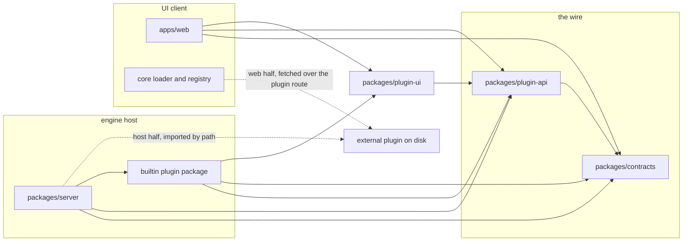
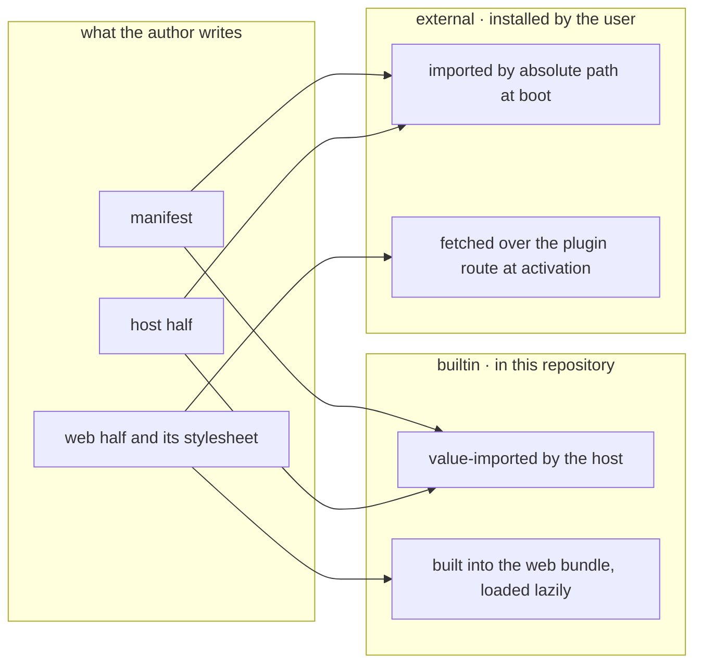
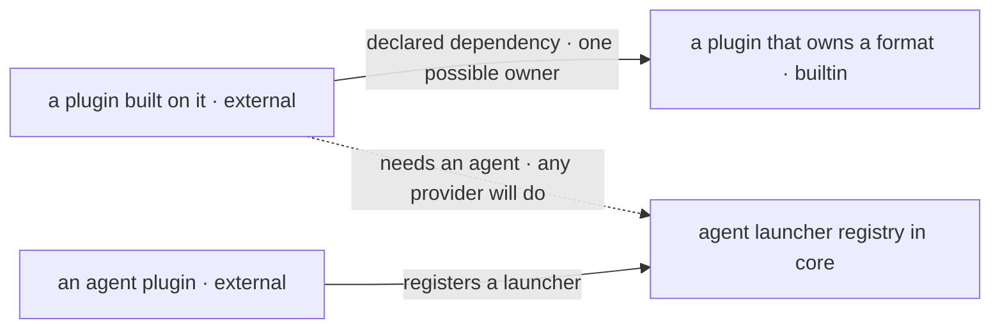
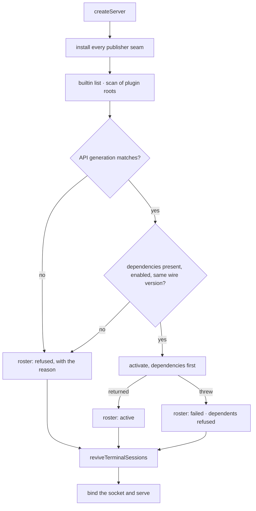
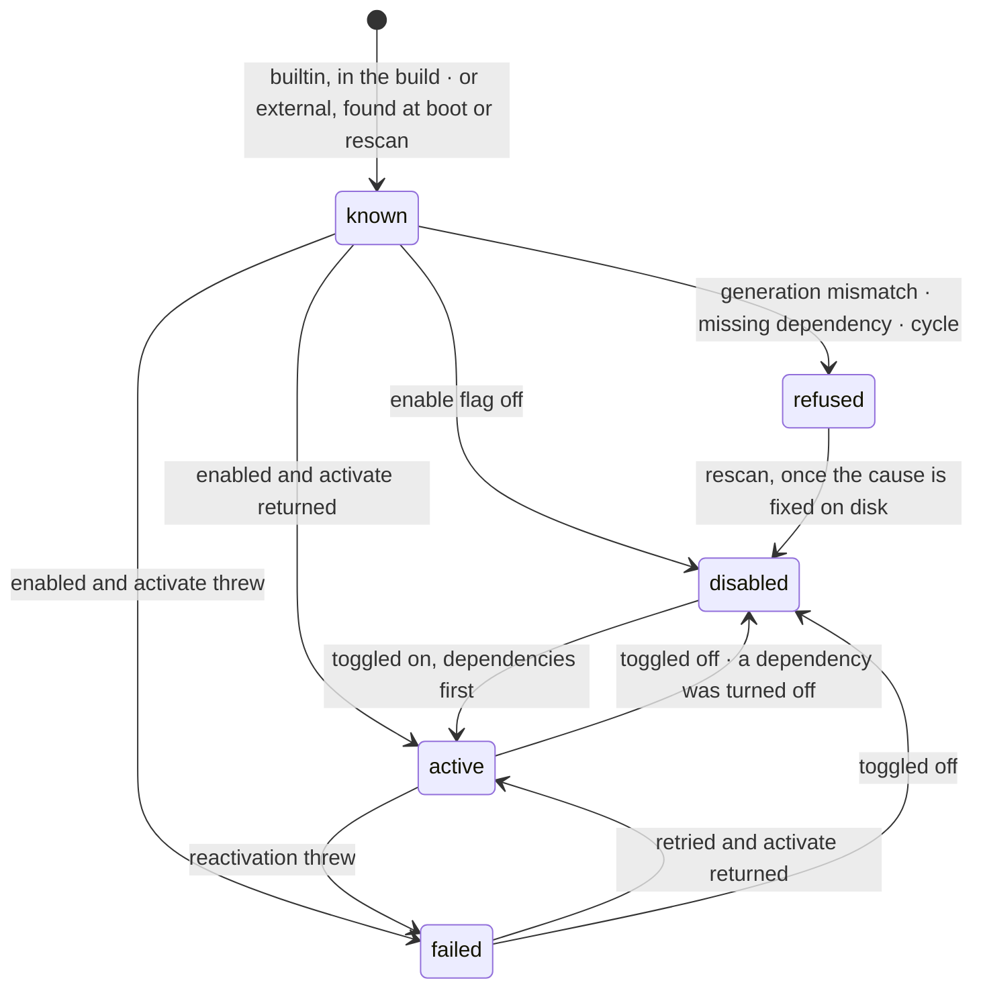
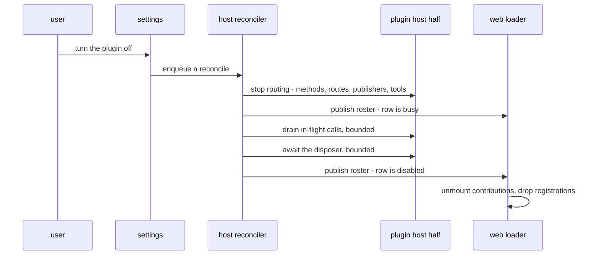
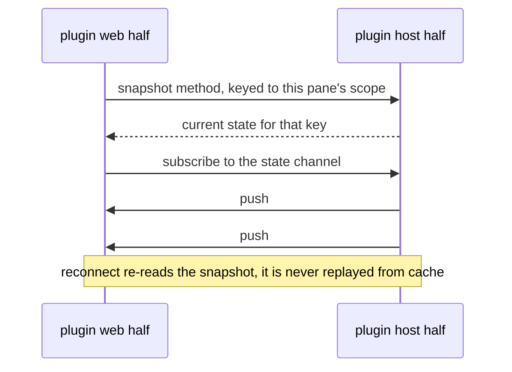
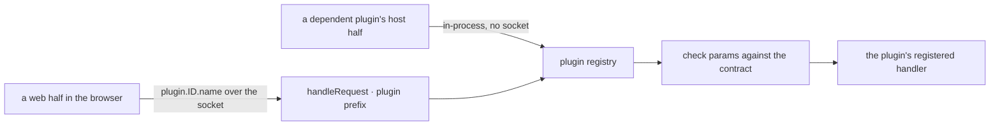

A ThinkRail feature currently reaches through every ring to exist: a method in the host's dispatch table,
a channel and the publisher that feeds it, a line in the web transport, a slice in the store, an arm in a
panel switch, and a row in several closed unions. This module is the contract that lets a feature live
outside core instead. A plugin is a manifest plus a host half, a web half, or both. It owns wire methods
and channels under its own namespace, and can mount an HTTP route, stamp PTY environment, register agent
tools, ship pi extensions and skills, observe host lifecycle, hold settings and persisted state, and
contribute a bounded set of UI surfaces.

A plugin is either builtin, living in this repository and shipped inside the artifact, or external, owned
by someone else and installed by the user. Both get the same capabilities. Every plugin can be turned on
and off while the app runs, with no restart and no reload, which is a requirement rather than an
optimisation and is why the loaders are built around it from the start.

The API is unstable, gated on a single generation integer, with no compatibility promise. What follows
fixes the boundary and the capability set. [[plugin-adoption]] is the companion plan: the core seams this
contract assumes and the features that adopt it.

## Responsibility

`@thinkrail/plugin-api` is the contract a self-contained feature is written against so that it can live
outside core. It contains types and a few identity helpers, and no runtime of its own. The runtimes that
implement it live in the rings that own the seams, `packages/server/src/plugins` and
`apps/web/src/plugins`, because only those may touch the WS dispatch table, the PTY, the store, or the
workbench.

### When something should be a plugin

Existing extension points come first. An agent capability is a pi extension or an MCP tool, joined to a
`registerToolRenderer` entry by tool name. pi already loads any installed extension into every session with
the full `ExtensionAPI` and the `pi.extensionUi` dialog bridge, and that needs no ThinkRail code at all.
This API covers what a pi extension cannot do on its own: own WS methods and channels, mount an HTTP route,
stamp PTY environment, observe host lifecycle, hold settings and state, and contribute UI.

The distinction applies per capability, not per feature. A feature whose agent side is already a portable
extension can still own a plugin for everything around it, and the plugin then declares that package rather
than absorbing it, so the package stays installable in plain pi.

### Builtin and external plugins

A builtin plugin lives in this repository, ships inside the artifact, and is updated in the same commit
that changes this contract. An external plugin is owned by someone else, released on their schedule, and
installed by a user.

Both declare the same manifest, receive the same capabilities, and appear in the same roster. Ownership
affects trust and lifecycle only: whether the manifest's default enablement is honoured, whether the API
generation is guaranteed to match, and what the user is told they are trusting. Delivery follows from
ownership rather than defining it.

Capability parity is deliberate. Most of the features this contract is measured against are external work,
so a capability restricted to builtin plugins would be unavailable to almost every consumer it has.

## Stability

This API carries no compatibility promise yet. There is no semantic versioning, no deprecation window, no
shims, and no commitment to keep a capability that stops being used. Any release may rename, reshape, or
remove anything described here, including the shared web runtime a plugin's UI is built against.

An integer called the API generation records the shape a plugin was built against. It is declared in the
manifest, incremented with any breaking change, and checked before load. A mismatch is refused and
reported, rather than allowed to half-load and fail somewhere further from the cause. Builtin plugins are
updated alongside it; external plugins are expected to break on upgrade and are told so directly. Since any
upgrade can therefore disable somebody's plugin, the refusal has to name the plugin, the generation it
declares, and the generation the host is on, or it reads as the app quietly losing features.

Two guarantees do hold. The wire remains versioned, because `apps/web` ships independently of the host and
has to detect drift (architecture Decisions 3 and 4). Persisted state remains readable across a generation
change, because user data is not part of the API.

### Recording the surface

No stability promise is not the same as no accounting. Every change to the plugin-facing surface has to be
visible in review, in the way Kotlin projects use a checked-in `.api` dump.

A generated API report is committed beside the code, one file per entry of this package plus one for the UI
kit, which is equally plugin-facing. It lists every exported name with its resolved type signature.
`bun run api:check` regenerates the report into a temporary location and fails on any difference from the
committed copy, and `bun run api:update` rewrites it. The check runs in CI rather than in the pre-commit
hook, alongside `check:spec-surface`.

The report is produced by extending the tooling that already exists here. `scripts/specSurface.ts` resolves
a barrel's effective exports through the TypeScript compiler, including type-only, default, and transitive
re-exports, so it already does the hard part and needs a signature printer rather than a new dependency. It
is worth noting that this file is being rewritten against TypeScript 7's compiler API on the fork, so the
report should be built on whichever API upstream settles on rather than the one in `main` today. Either way
the printer stays feasible: TypeScript 7 ships no JavaScript checker, but its `typescript/unstable/async`
client still exposes `typeToString` and signature lookups. If
printing signatures turns out to be fiddly, `@microsoft/api-extractor` produces this kind of report off the
shelf and is the fallback.

The report is a record, not a veto. Because the surface is expected to move, the gate's job is to make a
change impossible to land silently, and the reviewer decides whether it is acceptable. One rule is written
down for that judgement: removing an export, narrowing a parameter, or widening a return is a breaking
change and has to come with a generation bump. The generation constant is pinned by a test, the way
`wsProtocol.test.ts` pins `PROTOCOL_VERSION`, so a breaking change fails the suite until someone bumps it
deliberately.

## Boundary

- **Owns:** the contract vocabulary. A plugin declares one contract value naming its wire methods,
  channels, settings schema, and wire version. This package owns that shape, the manifest and roster
  shapes, the naming rules below, the pi-free tool-definition shape, and the two context interfaces.
- **Public surface:** three entries with no cross re-export. The root carries what both rings and the
  plugin share, `/host` the host context and its spec types, `/web` the web context and the UI contribution
  types. This document names the strings that are part of the contract, such as wire names, config keys,
  and route and tool id shapes, but not the type and function names, which are chosen when the barrels
  land.
- **Allowed deps:** `@thinkrail/contracts` (types), `typebox` (`catalog:`), and `react` types only at
  `/web`.
- **Forbidden:** any `pi` package, since the tool-definition shape re-declares the few fields it needs, as
  the fork's `packages/spec-graph/tools/shared.ts` does; `@thinkrail/server`, `@thinkrail/shared`,
  `apps/*`; any Node or Bun API; React components or any runtime beyond identity functions and name
  builders. The UI kit is a separate package, since components here would make this a runtime dependency
  of the browser bundle and of every plugin build.
- **Enrolment:** not `public-surface-checked` yet. Enrolling a spec with no barrel fails the check, so the
  tag is added with the code.

An arrow means "may depend on". There is no edge from a plugin to `packages/server`, none between two
plugin host halves, and none from any web half into the app's store, transport, or shell.

### Names that are part of the contract

| what | shape |
| --- | --- |
| WS method and channel | `plugin.<id>.<name>` |
| HTTP route, including the served web half | `/plugin/<id>/<subpath>` |
| side-tool id in a layout | `plugin:<id>:<tool>` |
| host settings | `AppConfig.plugins.<id>`, with `enabled` reserved to core |
| extra plugin roots | `AppConfig.pluginPaths` |
| host state files | `<dataDir>/plugin-state/<id>/<name>.json` |
| external plugin on disk | `<dataDir>/plugins/<id>/`, manifest `thinkrail-plugin.json` |
| client-local preference keys | `plugin:<id>:<key>`, endpoint-qualified |
| staged asset dir, builtin plugins | `plugins/<id>/<assetId>` |
| core roster wire | `server.welcome.plugins`, `plugins.list`, `plugins.changed` |

An id is lowercase alphanumeric with hyphens. For an external plugin it must equal its directory name, so
the id cannot claim more than the user placed there. Code and state live in sibling trees, so replacing a
plugin does not disturb the state it wrote.

## What a plugin is

A plugin is a manifest plus a host half, a web half, or both. A plugin with no host half is an ordinary
case rather than an exception.

### The manifest

The same fields have two carriers: a builtin plugin exports them from a typebox-free module, and an
external plugin ships them as `thinkrail-plugin.json`.

| field | meaning |
| --- | --- |
| `id` | the namespace for every string above; for an external plugin it must equal its directory name |
| `label` | shown in the roster, the Settings list, and a dormant tool placeholder |
| `icon` | a Remix Icon name; an unknown name falls back to a generic glyph, which keeps the icons-only invariant without admitting arbitrary SVG |
| `version` | the plugin's own version, informational |
| `apiGeneration` | refused before load if it does not match |
| `wireVersion` | incremented when the plugin's methods or channels change, so a separately shipped half can detect drift |
| `enabledByDefault` | honoured for builtin plugins; an external plugin always arrives disabled |
| `dependsOn` | other plugins, by id and exact wire version |
| `host`, `web`, `styles` | relative paths to the two ES-module entries and the web half's compiled stylesheet |
| `assets` | optional directory the host serves or hands to the plugin |
| `contributes` | the statically known parts: side tools with label, icon and default side; file viewers with extensions and read strategy |
| `pi` | extension entries and skill directories to load into agent sessions, whether they also reach sub-agent sessions, and whether they modify the system prompt |

`contributes` exists because two rules below need a contribution to be known before any plugin code runs.
The file-open dispatcher picks a read strategy on the layout-rehydrate path, which runs at socket connect,
and the layout engine has to name a side tool in order to render a dormant placeholder. Parts that need
code, such as the component or a finer predicate, are registered by the web half during activation.

### Delivery

Both paths hand the halves the same contexts. A builtin plugin is a workspace package with `./manifest`,
`./contracts`, `./host`, `./web`, and `./build-support` subpaths, separate tsconfigs so that a `node:`
import inside `./contracts` is a type error, and its own `SPEC.md`. It is a package rather than a directory
under `packages/server/src`, where the boundary checker could not forbid it from reaching server internals.
An external plugin is a directory holding the manifest, the built modules, the stylesheet, and any assets.

### The shared web runtime

A web half cannot bundle React, because two copies on one page break hooks, and it cannot rely on the app's
Tailwind build, which only emits utilities present at build time and drops unknown ones without an error.
Three rules follow.

React, ReactDOM, this package's `/web` entry, and the UI kit are provided by the host page through a
registry it installs on the window, and a plugin's build marks them external and reads them from there. An
import map is the tidier mechanism and can replace this later without changing what plugins import, but it
needs a browser floor this project has not established, and the registry needs no browser feature at all.

A plugin ships its own compiled stylesheet, declared in `styles`. Colour, spacing, and radius are expressed
through the published token custom properties, which are what `[data-theme]` swaps. A plugin that writes
literal values will stop responding to theme changes, and nothing will report it.

The UI kit is a real package, `packages/plugin-ui`. It carries the primitives and the heavy shared pieces:
the markdown renderer, the code editor, and the visualization card. It also becomes the single home for the
eleven shadcn primitives that `apps/web` copies today, and the app imports them from it, because two copies
of those would drift. The kit holds components only; theme tokens stay generated in `apps/web` and the kit
consumes the variable names, which makes the token names a contract documented in the kit's own spec.

Extracting the heavy pieces is cheaper than it looks. The editor reads only a handful of display settings
from the store, such as line width, which become props, and the visualization card already takes a props
object and two small helpers. Neither needs a rewrite.

### Trust

Discovery reads one directory, `<dataDir>/plugins`, plus any extra roots configured in `AppConfig`.
Projects, worktrees, and repository checkouts are never scanned, so a cloned repository cannot place
executable code in a host. This follows the line `skillAdmission` draws between personal and project-scoped
skills, applied more strictly because a skill is text for an agent while a plugin is code in the host
process and scripts on the page.

A discovered plugin is listed in Settings › Plugins as installed and off, with its label, version, any
manifest problems, its declared contributions, and whether it modifies the system prompt. Enabling it is
the roster toggle and an explicit per-plugin action. Nothing enables an external plugin automatically,
including a project, a settings sync, or an upgrade.

There is no sandbox. A host half runs in-process with the host's privileges and without crash isolation,
which is what the architecture already accepts for the agent, and a web half runs on the app's origin. A
fault takes down the host, and a malicious plugin has access to the user's machine. The trust model is the
install decision plus the enable toggle; stronger isolation would need the subprocess model the
architecture has already declined.

### Shipping pi extensions and skills

A plugin may carry agent capability as well as UI. The manifest's `pi` block names extension entries and
skill directories, and the loader feeds them to pi's resource loader alongside the host's own.

For a builtin plugin the extensions are value-imported factories through the existing bundled-runtime seam,
and its skills are staged the way `skillsDir` is today, because a compiled binary cannot path-load either.
For an external plugin both are real paths on disk, handed to pi's `additionalExtensionPaths` and
`additionalSkillPaths`. That is the mechanism pi already uses, and loading an extension from an external
filesystem path is proven inside the compiled binary by the Central artifact.

Skills carry `group = plugin id`, reusing the grouping the skills UI already has for plugin-supplied
skills. A plugin's extensions reach sub-agent sessions only when the `pi` block asks for it, off by
default, because a rule that reaches every delegated turn should be chosen rather than inherited.

A pi extension can append to the system prompt through `before_agent_start`, and for a feature that teaches
the agent a convention that rule is the point. A plugin that does so declares it in its `pi` block, and
Settings shows that on the row where the user turns the plugin on, so the fact is in front of them at the
moment the trust decision is made. On a hot toggle a system-prompt rule takes effect on the next turn
rather than the current one.

### Depending on another plugin

One plugin may be built on another: a document format owned by one plugin, consumed by a second. That names
one specific plugin rather than a behaviour any provider could supply, and it is ordinarily a dependency
across ownership, external on builtin.

A dependency is declared in the manifest and grants three things.

- Presence and order. A plugin whose dependency is absent, disabled, failed, or at a different wire version
  is refused, and the reason names the dependency. Activation runs dependency-first and disposal
  dependent-first in both rings. A cycle is refused at load.
- Types. The dependent may import the dependency's contract types. For a builtin dependency that is a
  package edge `check:boundaries` verifies; for an external one it is a build-time copy the dependent's
  author vendors, where the wire version makes drift visible.
- Calls. The dependent may invoke the dependency's declared wire methods and subscribe to its channels. On
  the web this is the ordinary request path. On the host the loader dispatches in-process, so that the host
  does not send itself a WebSocket message.

A dependency grants nothing beyond those three. It does not import the other host half, share objects, or
register into the dependency's surfaces, and there is no separate service interface. The grant is
wire-level, so it does not cover a synchronous render-time provider on the web. Those are registered into a
core slot instead, which is how one plugin's file icons reach another plugin's file picker without a
plugin-to-plugin edge in the browser.

A plugin cannot be enabled while a dependency is off, and the Settings toggle offers to enable both.
Turning a dependency off also turns off its dependents, which are named first. Turning it back on does not
re-enable them, since the user decides what runs.

Dependencies make one plugin's failure into another's, and a dependency chain is a boot-order constraint in
a system that otherwise has none. Two edges are manageable. A third is the point to ask whether the shared
part belongs in core instead.

Where several plugins could satisfy a need, a core contribution point is preferable to a dependency. A
feature that needs an agent to author with, where any agent plugin would do, goes through the launcher
registry. A feature that needs one specific plugin's format declares a dependency. The test is whether the
need names a capability or a particular plugin.

### Allowed dependencies of a plugin

A host half may depend on this package, `contracts`, `@thinkrail/shared`, a dependency's contract types,
and exact-pinned third parties. It may not depend on `@thinkrail/server`, `apps/*`, another plugin's host
half, or any `pi` package. The tool-definition shape is pi-free and the loader adapts it, so architecture
Decision 10's peer-dependency exemption does not extend to plugins.

A web half may depend on this package's `/web` entry, the UI kit, `react`, its own state library, a
dependency's contract types, and its own third parties. It may not reach the app's store, transport, shell,
or panel internals. It reaches the app through the web context alone, which is what allows it to live
outside this repository.

## Enforcement

1. Subpath-granular boundary rules. An allowed edge may name a package subpath, resolved against the target
   manifest's `exports`, and may be marked types-only against the import clause's type-only flag. That is
   what lets `apps/web` reach a plugin's contracts for types while its manifest remains the only value
   edge. Builtin plugin packages get their own rows, host and web separately.
2. A web-bundle gate. The rule is prose in `packages/contracts/SPEC.md` today. It becomes a script that
   runs after the web build and fails on typebox markers or on any plugin host module id. Alongside it,
   `sideEffects: false` on every plugin package and a typebox-free manifest subpath, so the eager registry
   never imports the barrel that holds top-level schema construction, which a bundler cannot prove pure.
3. A shared-runtime gate. A built web half must not contain React or the kit. This is checked in CI over
   builtin plugin web output, and the loader refuses an external module that instantiates a second React,
   which would otherwise appear as a blank pane and a console message.
4. One more loop in `check:seams`, over builtin plugin host sources and this package, with an empty
   allowlist. It walks only `@earendil-works/*` `dist/` today. The external loader's own import is the
   single deliberate exception, allowlisted with its reason and covered by `smoke:binary`.
5. `check:deps` is unchanged: exact pins, `catalog:` for cross-cutting dependencies.
6. Plugin e2e lives in `e2e/plugins/<id>/`, with fixtures in `e2e/fixtures/repo.ts`. One lane installs a
   fixture plugin from disk, since that is the path almost every plugin in scope takes.

## Loading, composition, the enable gate

Builtin plugins are composed statically in both rings: a literal array of value-imported host halves, and a
literal array of manifest plus lazy module in the web bundle. Dev, `bun build --compile`, and the desktop
runtime take one path, with no dev-path resolution, no jiti, and no `node_modules` at runtime (architecture
Decision 15).

External plugins are discovered and then loaded from disk. At boot the host lists `<dataDir>/plugins` and
any extra roots named in `AppConfig.pluginPaths`, reads each manifest, and refuses an id that does not match
its directory or an API generation that differs. For each enabled plugin it imports the host entry by
absolute path and serves the web entry, the stylesheet, and any assets under that plugin's route. The host
import is deliberately opaque to the bundler, so it is allowlisted in `check:seams` and verified by
`smoke:binary`. Importing a module by absolute path inside a compiled binary and a packaged desktop app has
no precedent in this repository, so those two gates decide whether the mechanism ships at all. A manifest
that does not parse, a missing entry, or a throwing import marks the plugin failed with its reason, and boot
continues.

Extra roots are a settings field rather than a separate file, so they are validated, broadcast, and
editable from Settings like anything else, and a plugin found in one still arrives disabled.

Assets for a builtin plugin ride the build-support manifest into the binary and the Electrobun runtime, in
the same way `skillsDir` does. An external plugin needs none of that, because its assets are already a
directory on disk.

`AppConfig.plugins.<id>.enabled` is owned by core inside the plugin's own namespace. A settings schema may
not declare `enabled`, and the plugin's settings type excludes it, so there is no second private toggle.
Under a roster gate, a plugin-private toggle would unmount the section the user is standing in.

Plugins install in `createServer` after every publisher seam and before `reviveTerminalSessions()`, so that
revive hooks see revived tabs. Within that window the order is topological by declared dependency. A
throwing activate is caught, the plugin is marked failed, its dependents are refused with that as the
reason, and boot continues. Deactivation is the first step of `stop()`, with synchronous disposers, because
`stop()` is synchronous while `shutdown()` may await.

A disabled plugin is inert rather than absent: methods answer a plain "disabled" error, routes return 404,
env contributors and tools are skipped, and publishers do nothing. Channels are the exception. Every known
plugin's channels are subscribed at socket open regardless of enablement, because Bun's pub/sub is
exact-topic and a publish on an unsubscribed topic reaches nobody without reporting it. The full set is
known before any socket opens.

Discovery is a read rather than a watch. It runs at boot and on an explicit rescan from Settings, so
installing a plugin does not need a restart either, but nothing watches the directory: a watcher over
executable code would re-import on every partial write an editor makes.

Web activation runs from `main.tsx` once the transport is up. Each plugin whose roster row is active and
whose wire version matches is loaded, from the bundle or from the plugin route, and activated. Manifests
are always registered, so a persisted `plugin:<id>:<tool>` tab can render "*label* is off" with the correct
label and icon before any module loads.

Teardown runs in reverse: plugins dispose first, and dependents before the plugins they depend on.

Settings › Plugins is a single section in core. It lists every roster row, builtin and external alike, with
label, icon, version, origin, toggle, declared contributions, whether the plugin modifies the system
prompt, and the reason for a failed or refused row. It is the only place a plugin is turned on, and the
only place a generation mismatch is explained.

Every transition is live and publishes the roster. None of them requires a restart, including recovery from
`failed` and from `refused`.

## Enabling and disabling at runtime

Every plugin can be turned on and off while the app runs. There is no restart of the host and no reload of
the browser, for builtin and external plugins alike.

### One reconciler, not a toggle handler

Desired state is `AppConfig.plugins.<id>.enabled` over the set of known manifests. Actual state is what the
registry currently has loaded. A single reconciler converges the two and then publishes the roster, and
every event that can change either side goes through it: boot, a settings change, a dependency cascade, a
retry, and a rescan. There is no separate toggle path to keep in step with the boot path.

The reconciler is serialised, one run at a time per host. A settings change enqueues a run rather than
acting inline, so two rapid toggles collapse into one convergence on the final desired state rather than
racing. A run computes the target set, then walks it in dependency order.

### Activation ids

Each activation of a plugin receives a monotonically increasing activation id, which is unrelated to the
API generation. Every registration and every callback the loader hands out closes over that id, and
anything arriving from a stale activation is dropped. This is what makes a toggle safe against work already
in flight: a late publish from a disposed activation cannot reach a client, and a timer the plugin forgot to
clear cannot resurrect it. The device is already used in this repository for filesystem watchers in
`@thinkrail/shared/jbcentral`. Hot disable is only as correct as the drain and these ids, so a publish or a
timer escaping a disposed activation is the case the tests have to cover.

### Disabling, host side

Disabling happens in three steps, in this order.

Routing stops first. Wire methods answer with the plain disabled error, routes return 404, publishers become
no-ops, env contributors are skipped for future spawns, and the plugin's tools are removed from the set
future sessions and turns will see.

Then in-flight work drains. The loader counts wire calls, route handlers, and tool runs belonging to the
current activation, and waits for that count to reach zero before tearing anything down, bounded by a
timeout after which it proceeds and logs. This is what keeps a tool call that is already executing from
losing the storage handle underneath it.

Then the disposer runs. On a toggle the loader awaits it, bounded, because a plugin with a second listener
has to close it. On host shutdown the disposer is not awaited, since `stop()` is synchronous. That
difference is the only asymmetry between the two teardown paths.

Persisted state is untouched. The plugin's config namespace and its state files stay exactly as they were,
so turning a plugin off and on again is not a reset.

### Enabling, host side

The module is imported if it is not already resident, then activate runs and its registrations take effect
immediately. If activate throws, the row becomes `failed` with the reason, desired state stays on so the
user can see that it is enabled and broken, and the Settings row offers a retry that triggers another
reconcile.

Live pi sessions are told to reload their resources when the tool or extension set changed. A session that
is mid-turn is not interrupted: the reload is deferred to `agent_settled`, which is the authoritative idle
point under this repository's invariants, rather than to `agent_end`.

### The web side runs the same reconcile

The roster is the contract between the rings. The web loader treats the roster it receives, from
`server.welcome` or from `plugins.changed`, as desired state, and the set of mounted plugins as actual
state. Reconnecting after a dropped socket is therefore not a special case.

Disabling unmounts a plugin's contributions and drops its registrations. It does not unload the module,
because an ES module cannot be removed from the heap once imported, so re-enabling re-registers without
fetching anything again and the memory is not reclaimed. A user toggling repeatedly pays for each updated
version they load.

One rule makes this safe in React: a contribution is rendered by its own wrapper component, keyed by plugin
id, so that every hook a contribution uses lives inside a component that mounts and unmounts as a whole. No
shared component's hook count may vary with the roster.

### Open resources when a plugin leaves

A side tool tab keeps its place in the layout and renders the dormant placeholder, so the frame is not
rearranged by a toggle and the tab is live again when the plugin returns. A companion pane collapses. A
file tab whose viewer has gone shows a placeholder offering to open the file as text, because the tab was
opened with a read strategy of none and its content was never fetched. A request already in flight to a
departing plugin fails with the disabled error, which the loader treats as expected during teardown rather
than surfacing as a failure.

### What is hot, and what is not

Enabling and disabling are hot for every plugin. Installing is hot after a rescan. Updating a plugin in
place is hot as well, because both loaders import with a version query derived from the file's content
hash, so changed bytes are a different module URL; the previous module stays resident, which is the cost of
not restarting.

Two things are deliberately not hot. A running terminal keeps the environment it was given at spawn, since
there is no way to restamp a live process, so a plugin's environment contribution reaches only terminals
started after it. And a tool call already executing finishes against the activation that started it, which
is what the drain step exists to allow.

## Wire

A plugin declares one contract value that both halves use: methods with typebox params and result schemas,
channels, a settings schema, and a wire version. The host validates against it, and the web half takes the
types from it.

Method and channel names are `plugin.<id>.<name>`. Core `PROTOCOL_VERSION` moves once, to carry the roster.
After that a plugin's changes move only its own wire version. A web half whose version differs from the
host's stays dormant with that as its reason, which matters most when the two halves can be updated
separately by someone outside the release train.

A state channel must name a snapshot method and how to key it, mapping the channel's scope onto that
method's params. This is architecture Decision 8 expressed in types: a channel keyed per workspace or per
terminal tab needs a keyed snapshot, which a param-less rule would not cover.

An event channel is documented as lossy and has no snapshot. It exists for host-to-client requests that
time out on their own. Plugin channels are never replayed from the transport's last-value cache, so no
per-subscription replay flag is needed.

Params are validated at dispatch, which is the first server-side validation in the codebase, so drift
between a handler and its schema will surface at runtime rather than at build time. A failure is an
ordinary `WsResponse.error` naming the offending path. This matters most for handlers upstream did not
write. Results and channel payloads are pinned by `bun test` against fixtures rather than validated per
frame, because typed schemas for a large config snapshot do not exist and the check would cost every frame.

No new `WsErrorCode` is added. The closed union earns a code only when a client behaves differently, and
clients learn enablement from the roster.

The one-time `packages/contracts` edit covers: a plugin-method template literal admitted by `WsMethodMap`
and the channel union; a roster entry carrying id, wire version, label, icon, version, origin, status
(active, disabled, failed, or refused), an optional reason, and declared contributions;
`ServerWelcome.plugins`; `AppConfig.plugins` and `AppConfig.pluginPaths` with their update shape; a
`plugin:` arm on `LayoutToolId`; and a feature-introduction constant pinned by `wsProtocol.test.ts`.
Carrying label, icon, and contributions on the roster is what lets the eager registry avoid value-importing
a plugin package, and lets an external plugin's contributions be known without loading its code. Status
alone encodes enablement. Module augmentation of `WsMethodMap` from plugin packages is rejected, since the
contracts surface would then depend on composition.

A plugin's declared methods have one implementation and two callers: the browser over the socket, and a
dependent plugin's host half in-process.

`handleRequest` falls through to the registry on the `plugin.` prefix, and the request replay cache applies
unchanged. The `fetch` handler consults the registry for `/plugin/<id>/` before static serving, which is
also how an external plugin's web module, stylesheet, and assets reach the browser.

Roster reads follow hydrate-then-stream. `server.welcome` seeds a connection, `plugins.list` reads the
roster at any time, and `plugins.changed` broadcasts after every activate, dispose, and failure.
`settings.changed` is not overloaded to carry it, because runtime status is not configuration and a tab
that never witnessed a toggle still has to be able to read it.

## Host capabilities

The host context is passed to activate, which may return a disposer. Every registration is recorded by the
loader and torn down on dispose, so a plugin keeps no cleanup bookkeeping of its own. The set is closed at
seventeen.

| # | capability | seam it replaces |
| --- | --- | --- |
| H1 | register a WS request method, with validated params and the calling client's key | the closed `handlers` record, 107 entries, no validation |
| H2 | publish on a declared channel, optionally addressed to one client | a `WS_CHANNELS` row, a subscribe line, a publisher seam, a `wireTransport.ts` line, per feature |
| H3 | mount an HTTP route under `/plugin/<id>/`, read the public base URL | the `fetch` if-chain |
| H4 | register a tool from one pi-free definition, declaring its surfaces | `sharedFactories` plus per-session extra factories |
| H5 | contribute PTY environment, computed per terminal | `ptyEnv()` sets `TERM` and `COLORTERM` only |
| H6 | mint and resolve a per-terminal identity token | none |
| H7 | read and write a typed agent record per terminal, persisted, broadcast, dropped on close | `PersistedTerminalTab` has no agent field |
| H8 | observe terminal lifecycle: spawned with pid, exited, closed, agent changed | none |
| H9 | offer a prefill when a terminal revives, returned by `terminal.attach` | none |
| H10 | write into a terminal host-side, bypassing client attachment | `writeTerminal` is client-gated |
| H11 | send text to a pi session, steering while streaming | `promptSession` throws while streaming |
| H12 | read projects and workspaces, start a watch, observe lifecycle and fs-change batches, feed auto-naming | `getWorkspace`, two publishers, `autoRename.ts`; nothing resolves a project id for a feature |
| H13 | read its own settings namespace and observe changes | `AppConfig` is closed; `loadConfig` spreads unknown keys untyped |
| H14 | read and write namespaced JSON state under the data dir | `readJson`/`writeJson` are module-private |
| H15 | a logger, its own asset path, activate and a disposer that may be async on a toggle | `logger(name)`; five hand-ordered install/teardown pairs |
| H16 | contribute pi extensions and skill directories, optionally to sub-agent sessions | the bundled extension list and skill roots are a fixed five |
| H17 | run git in a project or workspace through the host's bounded runner | `git(cwd, args)` is a server module a plugin may not import |

Git is a capability rather than something a plugin spawns for itself, which is the one exception to the
rule below that a host half is ordinary Bun code. The host's runner already has to disable terminal
prompts and run every child bounded and without a console window, and #438 shows that host git reads must
also set `GIT_OPTIONAL_LOCKS=0`, or the watcher sees them as repository changes and feeds a loop. A plugin
re-deriving those would reintroduce that loop.

Several things are deliberately absent. There is no whole-`AppConfig` read, since no feature reads core or
a sibling's namespace once settings are namespaced, and reading a sibling's namespace directly would bypass
the declared-dependency rule. There is no raw data-dir path, since H14 covers persistence. There are no
dialog, process, or filesystem wrappers, no generic event bus, and no core agent-kind framework. A host
half is ordinary Bun code, so `node:net`, `node:fs`, `Bun.serve`, and `@thinkrail/shared/spawn` are used
directly.

Per-client addressing in H1 and H2 exists for one case: a bridge that reports per-client editor facts and
has to answer the client that owns a terminal. Broadcasting such an action to every socket assumes the
layout is synchronised across clients, which is not true under architecture Decision 9, where each window
owns its own frame. A plugin channel may therefore carry per-client editor facts as reports tagged with the
reporting client, but never as authority installed on another client, and an action is addressed rather
than broadcast.

A tool is declared once, pi-free: name, label, description, an optional prompt snippet, typebox parameters,
and a run function receiving the resolved cwd, workspace, and optionally the owning terminal or session.
The loader adapts it to a pi tool through one core extension appended to `sharedFactories`, following the
`askUserQuestionExtension` precedent, and to a handle on the per-terminal MCP table bound to the token
owner. Renderers join by tool name, reached through the web context rather than by importing the chat
module.

## Web capabilities

| # | capability | seam it replaces |
| --- | --- | --- |
| W1 | request its methods, subscribe to its channels, read a keyed snapshot on mount and reconnect | `initTransport` hard-wires every channel to a store action |
| W2 | read and patch its own settings namespace | the `configPatch` whitelist |
| W3 | select from a read projection: projects, workspaces, active workspace, context project, active editor, config | store selectors |
| W4 | contribute a Settings section | a const enum, a sections array, a ternary chain |
| W5 | contribute a side tool under `plugin:<id>:<tool>`, declared in the manifest, rendered by the web half | closed `LayoutToolId`, the server's preset id set, the tool-body switch, and the layout engine's three tool tables |
| W6 | contribute an embedded companion pane to a terminal or chat host, and focus it | none |
| W7 | register a file viewer: extensions and read strategy from the manifest, component and finer predicate from the web half, optionally handling the open outright | the open path always reads text; the body renderer branches on markdown |
| W8 | decorate a tab with an icon or badge | an adornment slot exists; a per-tab icon slot does not |
| W9 | register an agent launcher, and enumerate registered launchers | the New Workspace dialog hard-codes pi |
| W10 | contribute a workspace-level action | the centre actions slot |
| W11 | contribute a terminal accessory row that can write, read the buffer tail, set key encoding | `TerminalInstance` owns xterm |
| W12 | observe editor events; open, close, list, check, save editors | the active-editor selector and the open helper; no selection events |
| W13 | open a terminal or chat, enter a project's default workspace, ask the host for a file picker | store actions plus `panels/defaultWorkspace.ts`, reachable only inside `panels` |
| W14 | build a byte URL for a worktree file, observe its revision, keep the workspace watched | the `/files` URL builder is private to one panel |
| W15 | observe reconnection and workspace removal | the connection generation and the removal reducer |
| W16 | reveal a tool by id | the chat names specific tools when it offers to reveal one |
| W17 | contribute a file-icon resolver, mapping a path and kind to a glyph, consulted wherever core renders a file | four independent Remix imports, in `Workbench.tsx`, `TreeRow.tsx`, `FileChip.tsx`, and `Composer.tsx`; changes rows carry no icon at all today |

W17 is provisional. It exists because file-type icons are being prototyped as a plugin, and it goes away if
core adopts them instead, as #411 asks.

Some contributions are excluded. There is no store-slice contribution, since a plugin owns its own state.
There are no plugin centre-tab kinds, which cost seven files. There are no layout-mode, drop-target,
context-menu, or group-metadata contributions, because layout modes stay in the app. Viewer and adornment
ordering is registration order, first non-null wins. A dormant plugin's tool tab keeps its slot. No
layout-arrangement verb is offered at all (architecture Decision 5). W3 is a read projection rather than
the store: no raw fs-change map, which W14 covers; no terminal catalog, since W11's owner and the typed
agent record carry identity; and no actions bag.

W5 needs a catalog seam rather than just an id pattern. Tool name, default side, and restore order are
closed records keyed by tool id inside `shell/layout/model.ts`, and `layout/` may not import feature
modules. The catalog therefore becomes an input of the pure engine, threaded through name lookup, tool-tab
construction, the unplaced-tool menus, and preset restore-target minting, and built by the shell
composition root from built-ins plus the roster's declared side tools. Without it a `plugin:` id validates,
renders an undefined name, and never appears in a reveal menu.

Editor events come from a small emitter under `panels`, fed by Monaco and the markdown preview, so nothing
in the editor needs to know an IDE bridge exists.

## Settings, persistence, client-local state

`plugins.<id>` is merged per namespace, two levels deep, touching only the ids present in an update, with a
null at the plugin level resetting that namespace. This matters because `updateConfig` spreads unknown keys
at the top level today, so the obvious update shape would delete every other plugin's namespace, reset
their enablement to manifest defaults, and cause the host to dispose them. A settings test writes two
namespaces in sequence and asserts that both survive.

Each touched namespace is validated against its schema with defaults filled before persist, cache, and
broadcast. An invalid namespace rejects the whole `settings.update`, matching the existing all-or-nothing
rule. An invalid namespace found at `loadConfig` falls back to defaults with one warning.

The web never writes settings locally. A patch is sent and the value changes when `settings.changed`
arrives, so the initiating client converges like any other. `configPatch` gains one line, which keeps the
store as the single source rather than a second projection inside each plugin.

Host persistence is namespaced under the data dir and survives the plugin being replaced. Facts scoped to a
terminal live in the typed agent record instead, so revive semantics stay with core.

Client-local preferences go through the stable-preference adapter under an endpoint-qualified key.
Companion visibility is core's device-local state (architecture Decision 9). Nothing plugin-local crosses
the wire.

Persisted layout has to tolerate unknown values. Tool-id validation accepts the `plugin:` pattern, and
preference parsing takes a default for a missing or invalid key rather than discarding the document. This
is more pronounced with external plugins, where a layout can name a tool from a plugin the user has since
removed.

## Out of scope (V1)

Contributing into another plugin's surfaces, and cross-plugin UI composition; optional dependencies and
version ranges; any registry, marketplace, installer, updater, or signature check, since installing is a
copy into a directory; sandboxing or crash isolation; unloading a disabled plugin's module from memory,
which an ES module does not allow; compatibility shims for an older generation; plugin centre-tab kinds,
layout intents, and layout modes; plugin-defined theme tokens or brand-mark exceptions; a host event bus;
core agent-kind detection; a generic settings form rendered by core, since a plugin has the kit and can
ship a real section; desktop menu or RPC contributions, since there is no desktop extension surface and
architecture Decision 2 keeps launchers thin; runtime validation of results and pushes; and an
external-file tab kind or widened filesystem containment for linked config files.
